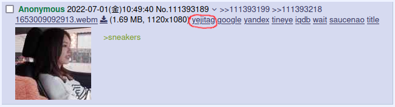
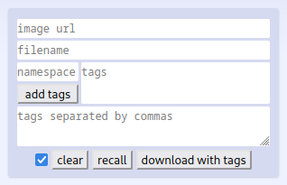

# Yejitag

Download images from 4chan(nel) along with a text file containing tags for import into Hydrus Network

## Requirements
- [hydrus network](https://hydrusnetwork.github.io/hydrus/)
- [boorutagparser-server](https://github.com/jetboom/boorutagparser-server)
- [Tampermonkey](https://www.tampermonkey.net) or [Greasemonkey](https://addons.mozilla.org/en-US/firefox/addon/greasemonkey/)

## Installation
After installing the requirements, [click here](https://github.com/yejibros/yejitag/raw/master/yejitag.user.js) to install the userscript
### 4chan X integration
If you are using [4chan X](https://github.com/ccd0/4chan-x) you can add a button to posts with images that will automatically fill in the image url and filename fields. It looks like this



Under `4chan X Settings -> Sauce` add the following after the `# Known filename formats` section
```text
# btp-server button
javascript:void(document.getElementById('imageurlfield').value = %URL)%semivoid(document.getElementById('filenamefield').value = (%name.replace(/\.[^/.]+$/, "")));text:btp-server
```

## Usage
*boorutagparser-server must be running to download images*



`image url` self-explanatory  
`filename` adds a tag with the filename: namespace. By default this is the uploader's filename  
`namespace and tags fields` add multiple tags with the same namespace. Be sure to click `add tags` before downloading  
`tags separated by commas` add tags here. For example, `person:ryujin,1girl,laughing`  
`checkbox` if unchecked, tags field will not be cleared after downloading or when clicking `clear`  
`clear` clears the fields  
`recall` cycles through the last 10 sets of downloaded tags  
`download with tags` downloads the image and tags  
